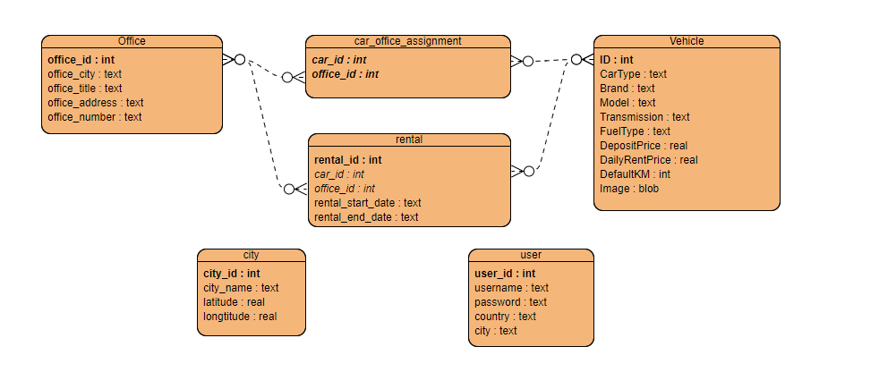

# Car Rental System

A simple car rental system implemented using Flask.

## Table of Contents

- [Introduction](#introduction)
- [Features](#features)
- [Getting Started](#getting-started)
  - [Prerequisites](#prerequisites)
  - [Installation](#installation)
- [Usage](#usage)
- [Contributing](#contributing)
- [License](#license)

## Introduction

This project is a basic car rental system developed with Flask. Users can register, log in, view available cars, and submit rental requests.

## Features

- User registration and login
- Car listing with rental information
- Form submission for rental requests
- User sessions to track logged-in users

## Assumptions

- If user not logged in, location will be DENİZLİ
- In default town informations are ; DENİZLİ - MERKEZ , İZMİR - ALSANCAK
- User can change selected town and iframe will be updated via that change
- Only 30 km closest offices will be listed
- Assuming company has offices only in İZMİR and DENİZLİ at the moment

## ER-Diagram

